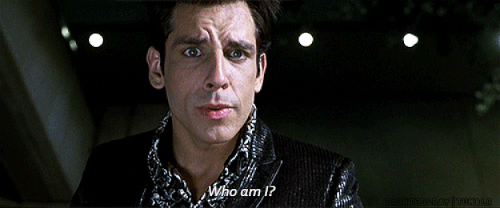
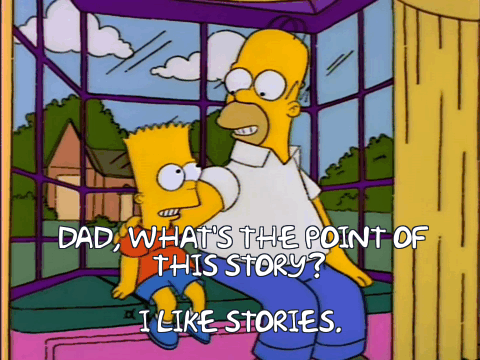

### Patch Management with Chef Automate

Nick Rycar

Lead Inside Solution Architect

Chef Software

---

## Who am I?

---

## Who am I?

#### Vital Stats

* ~10 yrs. Linux Systems Administration Experience
  * ~5 yrs. Chef Config Management
* 2.5 yrs. Chef Employee
  * Transitioned to sales role as an SA.
  * Powerless to make pretty decks without my marketing team.

---

---

# What is the goal of patch Management?

---

### The goal of patch management is...

"...to ensure the most up to date versions of my software are installed"

---

### The goal of patch management is...

~~"...to ensure the most up to date versions of my software are installed"~~

---

> apt-get dist-upgrade --force

---

> apt-get dist-upgrade --force

(or yum -y update, or Get-wuinstall -Windowsupdate -AcceptAll -Autoreboot...)

---

# Now what?

---

### The 'why' Stack

> pop the why stack max 5 times (ask why recursively)
> until you end up with one of the following business values:

> * Protect revenue

> * Increase revenue

> * Manage cost

---

### The 'why' Stack

>If you’re about to implement a feature that doesn’t support one of those values, chances are you’re about to implement a non-valuable feature. Consider tossing it altogether or pushing it down in your backlog.
- Aslak Hellesøy, creator of Cucumber

---

### The goal of patch management is...

~~"...to ensure the most up to date versions of my software are installed"~~

"... to reduce the **risk** "

---

### Risk comes in many forms

* What is the risk of not upgrading?

* What is the risk of upgrading?

* Did I upgrade successfully?

---

### The best part

The "upgrade" part is still easy!

> apt-get dist-upgrade --force

---

### Patch management with Chef Automate

* Compliance Visibility <-- Risk of not upgrading.

* Workflow <-- Risk of upgrading

* Convergence & Compliance Visibility <-- Check your work.

---

## What questions can I answer?

---

# Thanks!

nrycar@chef.io
